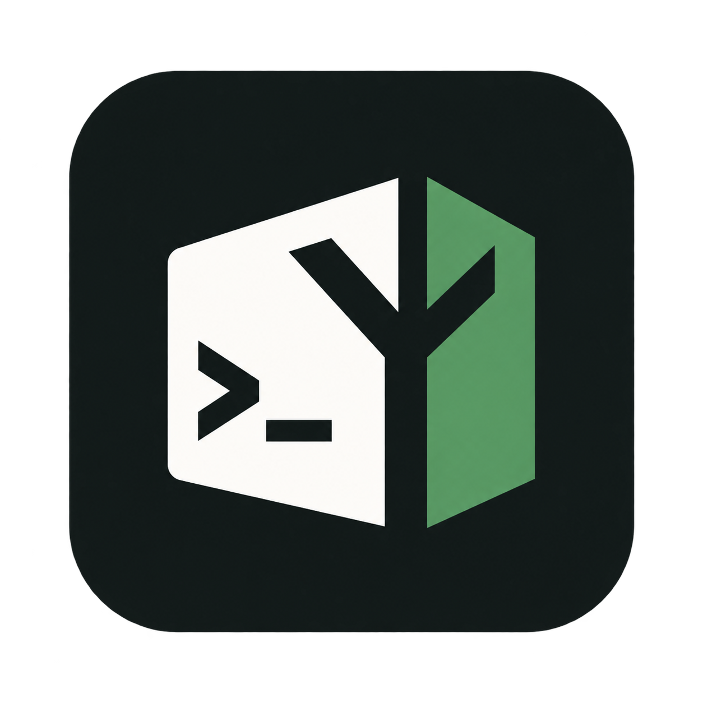

---
hide:
  - toc
---

# Repository policy. Explicit inputs. Clear results.

{ width="128" height="128" }

YAGA is a Python CLI for checking commits, workflows, and Git trees with the same policy
locally and in CI. Adopt one check at a time, then bring them together in a repository plan.

[Get started](getting-started.md){ .md-button .md-button--primary }
[Explore the commands](commands.md){ .md-button }

<div class="yaga-facts" markdown>

**Python 3.12+** · **Local CLI & CI** · **Versioned JSON reports** · **0.1.0 · Beta**

</div>

## Start with one check

Install from PyPI as a user-wide tool:

```bash
uv tool install --python 3.12 yaga-cli
uv tool update-shell
```

Open a new terminal, change into your project, and check a complete commit message:

```bash
yaga commit check --message "feat(cli): add a policy check

Explain the new check with enough context for future maintainers."
```

The distribution is **`yaga-cli`**; the command is **`yaga`**. See
[Get started](getting-started.md) for pipx and pip alternatives, policy setup, and source installs.

## Choose what your repository needs

<div class="grid cards" markdown>

- **Commit conventions**

    Check message structure, scopes, bodies, and footers. Apply header policy to pull-request
    titles, or install a local commit-message hook.

    [Define commit policy](commit-policy.md)

- **Repository contents**

    Check required paths, file sizes, portable names, and entry modes against an exact commit.
    Combine providers in an explicit plan.

    [Build a repository plan](repository-checks.md)

- **Workflow checks**

    Check immutable references, apply a versioned Actions security policy, and lint syntax
    with pinned actionlint. Each check has its own report.

    [Set up GitHub Actions](github-actions.md)

- **Adopt incrementally**

    Start with a local command, add a hook or CI check, and keep the policy in your repository.
    Branch names and changed-path rules use explicit inputs too.

    [Find an adoption recipe](recipes.md)

</div>

## Predictable in scripts and CI

Checks report **`0` for pass**, **`1` for policy findings**, and **`2` for input or operational
errors**. Use `--format json` for versioned reports or `--format github` for escaped annotations.
Git-backed checks do not fetch history. Revision-bound tree checks inspect committed objects;
they do not substitute working-tree or staged changes.

See [Usage modes](usage.md) for input selection and [Troubleshooting](troubleshooting.md) when
a check cannot run. Docker is required for `workflow lint` and repository plans that select it.

## Optional review tools

[Commit quality](commit-quality.md) provides model-backed advice alongside deterministic commit
policy. The [Agent review gate](agent-review-gate.md) supports explicit review plans and receipts;
its experimental GitHub adapter has additional deployment and trust requirements.

YAGA 0.1.0 is beta. CLI and configuration contracts may still change. Pin an exact audited
commit SHA for Action consumers and read the [security model](security.md) before enabling the
write-capable review adapter. See the [changelog](changelog.md) for release history.
